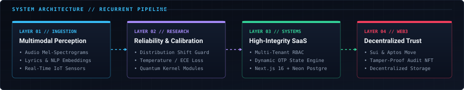

<div align="center">
  
</div>

<br />

```yaml
system: PTANH-RESEARCH-NODE-01
operator: Phùng Thế Anh (@ptanh05)
affiliation: Hanoi, Vietnam [21.0285° N, 105.8542° E]
focus: Reliable Multimodal Intelligence × Production Systems × Web3
runtime: Online [Verified GitHub Telemetry]
```

---

### // 01. IDENTITY & TECHNICAL THESIS

I am a computer science researcher and software engineer focusing on **reliable artificial intelligence**, **full-stack software systems**, and **decentralized infrastructure**.

My work bridges the gap between empirical machine learning research and real-world system resilience:
- **In AI/ML**: I investigate multimodal learning architectures under real-world distribution shifts, missing sensory modalities, and predictive uncertainty calibration.
- **In Systems Engineering**: I design and ship multi-tenant, tamper-resistant web platforms with strict state machines, hardware trust models, and server-side RBAC.
- **In Decentralized Protocols**: I build smart contracts (Move & Solidity) and supply-chain verification networks anchored to high-throughput blockchains (Sui & Aptos).

---

### // 02. CORE RESEARCH & FOCUS AREAS

```
┌───────────────────────────────┬───────────────────────────────┐
│ 01 // MULTIMODAL RELIABILITY   │ 02 // PROBABILITY CALIBRATION │
│ Dynamic modality weighting,   │ ECE minimization, temperature │
│ cross-attention fusion under  │ scaling, and OOD detection    │
│ acoustic/visual missingness.  │ for high-stakes decisions.    │
├───────────────────────────────┼───────────────────────────────┤
│ 03 // HIGH-INTEGRITY SYSTEMS  │ 04 // WEB3 INFRASTRUCTURE     │
│ Server state machines, audit  │ Object-centric smart contracts│
│ logging, hardware trust, and  │ (Move), cryptographic audit   │
│ multi-tenant SaaS isolation.  │ trails, and NFT verification. │
└───────────────────────────────┘
```

---

### // 03. SYSTEM ARCHITECTURE

<div align="center">
  
</div>

---

### // 04. FEATURED RESEARCH & EMPIRICAL BENCHMARKS

<table>
<tr>
<td width="50%" valign="top">

#### 🔬 [RM-VMusic](https://github.com/ptanh05/RM-VMusic)
**Reliable Multimodal Vietnamese Music Classification**

A scientific benchmark and research framework investigating multimodal reliability, probability calibration, and distribution shifts.

- **12-Class Benchmark**: Evaluated on $N=5,515$ tracks across $2,746$ unique artists with strictly verified 0% artist leakage.
- **Missing Modality Fallbacks**: Evaluates linguistic (lyrics) and visual (cover art) representations when acoustic audio streams are corrupted or absent.
- **Uncertainty Calibration**: Mitigates overconfident misclassifications across decades of cultural audio distribution shifts.

`PyTorch` `Librosa` `Transformers` `Multimodal Fusion` `Calibration`

</td>
<td width="50%" valign="top">

#### 🌊 [AI Aquaculture Guardian](https://github.com/ptanh05/AI-Based-pH-Monitoring-and-Alert-System-for-Aquaculture-Ponds)
**Edge-Native Predictive Early-Warning System**

Explainable decision-support system forecasting water quality degradation up to 150 minutes in advance for sustainable aquaculture ponds.

- **Edge Performance**: Verified $1.42\text{ ms}$ (P50) inference latency on edge microprocessors.
- **Empirical IoT Dataset**: Validated against $37,284$ real IoT sensor readings across ambient pond conditions.
- **Human-in-the-Loop**: Generates dynamic Aquaculture Risk Scores (0–100) with rule-based intervention protocols.

`Python` `Edge AI` `Time-Series Forecasting` `IoT` `Decision Support`

</td>
</tr>
<tr>
<td colspan="2" valign="top">

#### ⚛️ [QFraud Shield (Quantum-Kernel-SVM)](https://github.com/ptanh05/Quantum-Kernel-SVM)
**Hybrid Classical & Quantum ML Financial Anomaly Detection**

A high-throughput fraud detection engine combining classical tree ensembles for production screening with simulated Quantum Kernel SVMs for non-linear feature boundary exploration.

- **Production Core**: Classical Random Forest model delivering $\text{F1} = 84.04\%$ on imbalanced credit card transaction streams.
- **Quantum Research Module**: Quantum state feature mapping simulated with Qiskit quantum circuits to benchmark quantum kernel advantage.
- **Telemetry & Explainability**: 10-endpoint REST API with real-time risk scoring (0–100) and automated causal explanations.

`Python` `Qiskit` `Scikit-Learn` `FastAPI` `Quantum ML` `Explainable AI`

</td>
</tr>
</table>

---

### // 05. PRODUCTION SYSTEMS ENGINEERING

<table>
<tr>
<td width="50%" valign="top">

#### 🛡️ [SmartAttend](https://github.com/ptanh05/SmartAttend)
**Multi-Tenant University Attendance SaaS Engine**

Full-stack production platform for tamper-resistant attendance verification across institutional campuses.

- **Multi-Tenant Isolation**: Complete organizational boundary enforcement backed by Neon PostgreSQL and Drizzle ORM.
- **Anti-Cheating State Machine**: Dynamic rotating 6-character OTP challenge codes with strict TTLs and hardware trust scoring (0–100).
- **Enterprise RBAC**: Segregated portals for Students, Faculty, Department Staff, and System Administrators.

`Next.js 16` `TypeScript` `Neon PostgreSQL` `Drizzle ORM` `Tailwind CSS`

</td>
<td width="50%" valign="top">

#### 📋 [Smart-FYP-Management](https://github.com/ptanh05/smart-fyp-management)
**Academic Thesis & Capstone Lifecycle Platform**

End-to-end management infrastructure coordinating student project workflows, supervisor review pipelines, and cross-repo auth contracts.

- **Contract-Driven Architecture**: Schema-verified authentication and cross-service role validation.
- **Production Verification**: Complete database migrations, automated signoff pipelines, and deployment configs.
- **Workflow State Management**: Multi-stage approvals from proposal intake to final defense grading.

`Python` `TypeScript` `FastAPI` `PostgreSQL` `Docker` `Render`

</td>
</tr>
</table>

---

### // 06. WEB3 & DECENTRALIZED PROTOCOLS

<table>
<tr>
<td width="50%" valign="top">

#### 💊 [Pharma DNA 2025](https://github.com/ptanh05/Pharma_DNA_2025)
**Pharmaceutical Traceability on Sui Blockchain**

End-to-end pharmaceutical supply chain tracking anchoring batch provenance from drug manufacturer to patient delivery.

- **On-Chain Move Contracts**: Smart contracts deployed to Sui blockchain minting immutable batch NFTs.
- **Distributed Storage**: Decentralized metadata persistence via IPFS (Pinata) with real-time SSE event feeds.
- **Autonomous Monitoring**: Integrated LangChain agent monitoring telemetry logs for supply chain anomalies.

`Sui Move` `Next.js 15` `TypeScript` `PostgreSQL` `Redis` `IPFS`

</td>
<td width="50%" valign="top">

#### 🎓 [Aptos Certificate Platform](https://github.com/ptanh05/APTOS-CERTIFICATE-PLATFORM)
**Verifiable Academic Credentials on Aptos**

Cryptographic credential verification DApp issuing tamper-evident academic diplomas and certificates.

- **Object-Centric Move Logic**: Non-transferable Soulbound credential primitives enforcing revocation registries.
- **Client-Side Verification**: Instant cryptographic proof validation for third-party recruiters and employers.
- **Wallet Orchestration**: Native integration with Aptos wallet adapters and transaction signing flows.

`Aptos Move` `TypeScript` `Next.js` `Tailwind CSS` `Web3 SDK`

</td>
</tr>
</table>

---

### // 07. TECHNICAL CAPABILITY MATRIX

```
AI / RESEARCH
  Languages & Libs  :: Python · PyTorch · Librosa · Scikit-Learn · Qiskit
  Focus Disciplines :: Multimodal Learning · Distribution Shift · Probability Calibration
  Tooling & Visuals :: Matplotlib · Seaborn · NumPy · Pandas · Edge ML Inference

SYSTEMS & FULL-STACK
  Core Frameworks   :: Next.js (App Router) · React · Node.js · Express · FastAPI
  Languages         :: TypeScript · JavaScript · C# · Python
  Databases & Cache :: PostgreSQL · Neon DB · Supabase · Redis · Drizzle ORM · Prisma

BLOCKCHAIN & PROTOCOLS
  Smart Contracts   :: Move (Sui & Aptos) · Solidity (EVM)
  Ecosystems        :: Sui Network · Aptos · Cardano
  Web3 Architecture :: Soulbound Credentials · Supply Chain NFTs · IPFS (Pinata)

INFRASTRUCTURE & DEVOPS
  CI / CD & Tooling :: GitHub Actions · Git Workflow · Vite · pnpm · npm
  Hosting & Deploy  :: Vercel · Render · Docker · Cloudflare
```

---

### // 08. LIVE SYSTEM TELEMETRY

<div align="center">
  
</div>

> *Telemetry is dynamically aggregated from the GitHub REST API and refreshed every 24 hours via [`.github/workflows/update-profile.yml`](./.github/workflows/update-profile.yml).*

---

### // 09. RESEARCH & ENGINEERING PRINCIPLES

- **01 // Empirical Rigor Over Hype**: Evaluate systems under corrupted inputs, adversarial distribution shifts, and worst-case operating bounds rather than benchmark cherry-picking.
- **02 // Production-Grade Determinism**: Machine learning models without reliable calibration, explicit state machines, and hardware security models are toy demonstrations.
- **03 // Native Performance & Clean Architecture**: Maintain minimal external dependency footprints, strict type boundaries, and explicit database transaction guarantees.

---

### // 10. VERIFIED COORDINATES

<div align="center">

[](https://github.com/ptanh05)
&nbsp;&nbsp;
[](https://x.com/GaCon_DiBo)

</div>

<div align="center">
  <sub><code>PTANH05 // AI RESEARCH LAB · RECURRENT TELEMETRY ACTIVE</code></sub>
</div>
