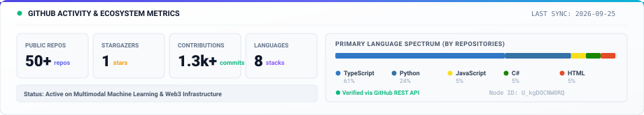
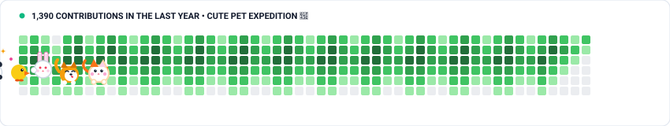

  
   
  

  
  &nbsp;
  
  &nbsp;
  
  &nbsp;
  

  <i>"Reliable intelligence is not measured by performance on ideal data, but by robustness when the world shifts and senses fail."</i>

  

### 👨‍💻 About Me

I'm a Computer Science student and software engineer focusing on **reliable artificial intelligence**, **production-grade software systems**, and **Web3 infrastructure**.

My work sits at the intersection of:
- **Multimodal AI & Reliability**: Studying learning systems under distribution shift, missing modalities, and probability calibration.
- **Full-Stack & SaaS Engineering**: Architecting multi-tenant, tamper-resistant web platforms with strict security and state machines.
- **Blockchain Protocols**: Building smart contracts and decentralized verification pipelines on **Sui** and **Aptos**.

  

### 🔭 Currently Exploring

<table>
  <tr>
    <td width="50%" valign="top">
      <h4>🔬 Reliable Multimodal Learning</h4>
      
Investigating dynamic modality weighting and representation fallbacks when audio, visual, or textual sensory inputs are corrupted or missing.

    </td>
    <td width="50%" valign="top">
      <h4>🎯 Uncertainty &amp; Calibration</h4>
      
Benchmarking probability calibration (ECE), temperature scaling, and out-of-distribution (OOD) detection for high-stakes decision support.

    </td>
  </tr>
  <tr>
    <td width="50%" valign="top">
      <h4>🛡️ Production SaaS Architecture</h4>
      
Building high-integrity web engines with multi-tenant isolation, dynamic challenge state machines, and hardware trust verification.

    </td>
    <td width="50%" valign="top">
      <h4>⛓️ Move Ecosystem (Sui &amp; Aptos)</h4>
      
Developing object-centric smart contracts, tamper-proof audit trails, and Soulbound verifiable credential platforms.

    </td>
  </tr>
</table>

  

### 🚀 Featured Projects

<table>
  <tr>
    <td width="50%" valign="top">
      <h3>🔬 <a href="https://github.com/ptanh05/RM-VMusic">RM-VMusic</a></h3>
      

      
<b>Reliable Multimodal Vietnamese Music Classification</b>

      
Scientific benchmark exploring multimodal reliability, modality missingness fallbacks, and uncertainty calibration with 0% artist leakage across 5,515 tracks.

      
<code>Python</code> <code>PyTorch</code> <code>Transformers</code> <code>Multimodal AI</code>

      
<a href="https://github.com/ptanh05/RM-VMusic"><b>View Repository →</b></a>

    </td>
    <td width="50%" valign="top">
      <h3>🛡️ <a href="https://github.com/ptanh05/SmartAttend">SmartAttend</a></h3>
      

      
<b>Multi-Tenant University Attendance SaaS Engine</b>

      
Production platform with dynamic 6-character rotating challenge codes, server-side state machines, anti-cheating hardware trust scoring, and strict RBAC.

      
<code>Next.js 16</code> <code>TypeScript</code> <code>Neon PostgreSQL</code> <code>Drizzle ORM</code>

      
<a href="https://github.com/ptanh05/SmartAttend"><b>View Repository →</b></a>

    </td>
  </tr>
  <tr>
    <td width="50%" valign="top">
      <h3>⚛️ <a href="https://github.com/ptanh05/Quantum-Kernel-SVM">QFraud Shield</a></h3>
      

      
<b>Hybrid Classical &amp; Quantum ML Financial Fraud Detection</b>

      
Financial anomaly detection platform combining a classical Random Forest engine (F1=84.04%) with Qiskit-simulated Quantum Kernel SVM modules.

      
<code>Python</code> <code>Qiskit</code> <code>Scikit-Learn</code> <code>FastAPI</code>

      
<a href="https://github.com/ptanh05/Quantum-Kernel-SVM"><b>View Repository →</b></a>

    </td>
    <td width="50%" valign="top">
      <h3>💊 <a href="https://github.com/ptanh05/Pharma_DNA_2025">Pharma DNA 2025</a></h3>
      

      
<b>Pharmaceutical Supply Chain Traceability on Sui</b>

      
End-to-end medicine traceability anchoring batch provenance from manufacturer to patient using Sui Move smart contracts and IPFS metadata.

      
<code>Sui Move</code> <code>Next.js 15</code> <code>PostgreSQL</code> <code>IPFS</code>

      
<a href="https://github.com/ptanh05/Pharma_DNA_2025"><b>View Repository →</b></a>

    </td>
  </tr>
  <tr>
    <td width="50%" valign="top">
      <h3>📋 <a href="https://github.com/ptanh05/smart-fyp-management">Smart-FYP Management</a></h3>
      

      
<b>Academic Thesis &amp; Capstone Lifecycle Platform</b>

      
Full lifecycle system coordinating student capstone workflows, supervisor approval pipelines, and contract-verified authentication.

      
<code>Python</code> <code>TypeScript</code> <code>FastAPI</code> <code>PostgreSQL</code>

      
<a href="https://github.com/ptanh05/smart-fyp-management"><b>View Repository →</b></a>

    </td>
    <td width="50%" valign="top">
      <h3>🌊 <a href="https://github.com/ptanh05/AI-Based-pH-Monitoring-and-Alert-System-for-Aquaculture-Ponds">AI Aquaculture Guardian</a></h3>
      

      
<b>Edge-Native Predictive Early-Warning System</b>

      
Decision-support system forecasting water quality degradation up to 150 minutes in advance with 1.42ms edge latency across 37,284 IoT readings.

      
<code>Python</code> <code>Edge AI</code> <code>IoT Forecasting</code> <code>Decision Support</code>

      
<a href="https://github.com/ptanh05/AI-Based-pH-Monitoring-and-Alert-System-for-Aquaculture-Ponds"><b>View Repository →</b></a>

    </td>
  </tr>
</table>

  

### 🛠️ Tech Stack

  

 

  <b>AI &amp; Machine Learning</b> 
  <code>Python</code> &bull; <code>PyTorch</code> &bull; <code>Scikit-learn</code> &bull; <code>Transformers</code> &bull; <code>Librosa</code> &bull; <code>Qiskit</code> &bull; <code>NumPy</code> &bull; <code>Pandas</code>

  <b>Frontend Engineering</b> 
  <code>TypeScript</code> &bull; <code>JavaScript</code> &bull; <code>React</code> &bull; <code>Next.js (App Router)</code> &bull; <code>Tailwind CSS</code>

  <b>Backend &amp; Database Systems</b> 
  <code>Node.js</code> &bull; <code>FastAPI</code> &bull; <code>PostgreSQL</code> &bull; <code>Neon DB</code> &bull; <code>Supabase</code> &bull; <code>Redis</code> &bull; <code>Drizzle ORM</code>

  <b>Blockchain &amp; Decentralized Infrastructure</b> 
  <code>Sui Move</code> &bull; <code>Aptos Move</code> &bull; <code>Solidity</code> &bull; <code>IPFS (Pinata)</code>

  <b>DevOps &amp; Tooling</b> 
  <code>Docker</code> &bull; <code>GitHub Actions</code> &bull; <code>Vercel</code> &bull; <code>Render</code> &bull; <code>Git</code>

  

### 📊 GitHub Activity &amp; Telemetry

  

 

  

  <i>1,390 Contributions &bull; Daily cute pet expedition 🐾 &bull; Updated daily</i>

  

### 📬 Connect &amp; Collaborate

Feel free to reach out for research discussions, engineering collaborations, or Web3 opportunities:

  
  &nbsp;
  
  &nbsp;
  
  &nbsp;
  

  
  
Designed for GitHub Light Mode &bull; Built by <b>Phùng Thế Anh</b> (@ptanh05)

